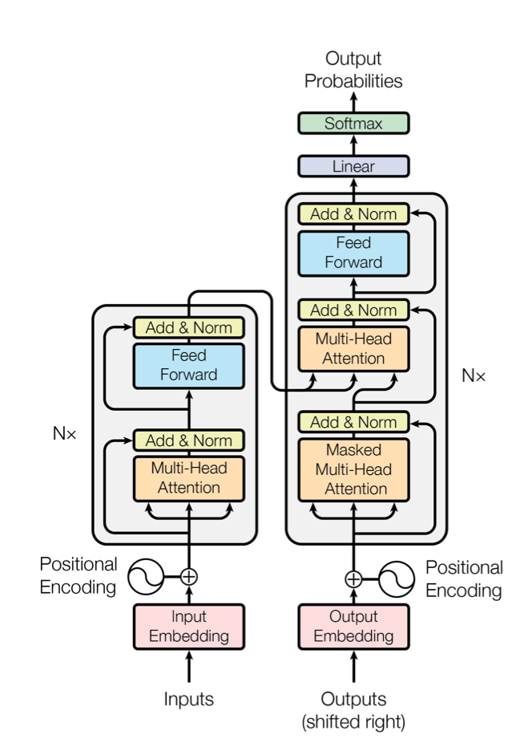

# transformer_pytorch

Implementation of tramsformer([Attention Is All You Need, 2017](https://arxiv.org/abs/1706.03762)) with pytorch on translation, classification, generation.



## Training
Training transformer for translation.

### Dataset

- Multi30K(English-Deutsch)
    - train: 29000
    - valid: 1014
    - test: 1000

### Train

```
$ python train.py
```

### Experiments

**max BLEU**: 0.358628 (at 28 epoch)
```
[test sample]
target:Ein Junge steht auf <unk> Weise bei einem geselligen Anlass herum ., 
output:Ein Junge steht mitten in der Mitte eines <unk> .
```

## Next
- Add example for clasification task.
- Add example for generation task.


